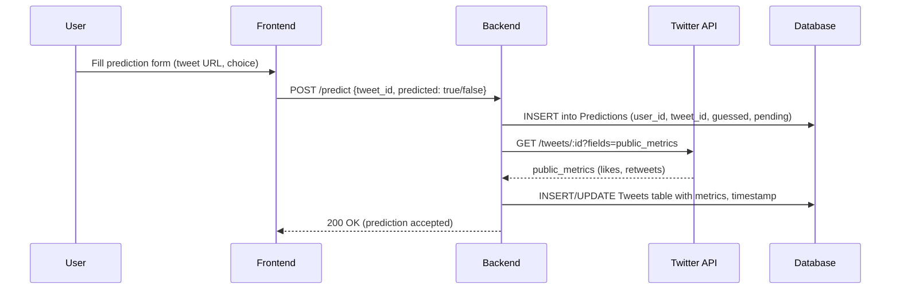
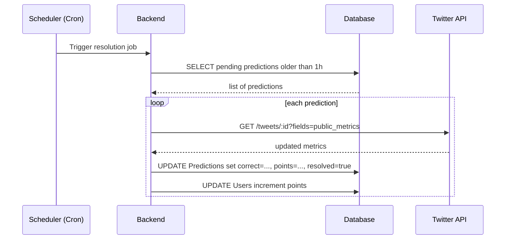

# Executive Summary  
This SDD (spec-driven development) document defines a **Trend-Spotting Game** platform where users predict which social posts will go viral. It covers purpose, scope, success metrics, personas, features (MVP→v1→v2), user stories, backlog, API integrations (Twitter/X OAuth and endpoints, Supabase, optional AI), system architecture, data flows, DB schema, privacy/retention, telemetry, security, deployment, testing, roadmap, and risks. The project enables users to log in with Twitter, place “virality” bets on tweets or hashtags, and earn points/badges for correct predictions. Key success metrics include active users, prediction volume, retention, and leaderboards. Core APIs include `GET /2/tweets/:id` (public_metrics) and `GET /2/users/:id/tweets`【59†L384-L389】, along with Supabase Auth/DB for persistence. We detail mermaid flowcharts for submission and resolution, and example API requests/responses. Telemetry and monitoring plans (events like `prediction_submitted`) and CI/CD deployment on Supabase/Vercel are outlined. This doc also lists assumptions (e.g. no real-money bets, static virality thresholds) as open issues. Every requirement is precise to guide engineers, designers, and PMs. The design emphasizes scalability and compliance (e.g. adhering to Twitter rate limits【61†L364-L372】【59†L384-L389】, data retention policies), with thorough risk and mitigation plans. 

## Project Purpose and Scope  
**Purpose:** Create a gamified platform for users to predict trending social content. The goal is to engage users through competition and social sharing, leveraging real-time Twitter/X data. The platform will validate predictions against actual post metrics and maintain a public leaderboard.  

**Scope:** In MVP, users must log in (Twitter OAuth), submit predictions on recent tweets, earn points for correct calls, and view leaderboards. Scope excludes real-money betting and full ML-powered trend prediction (only simple heuristics/ thresholds). Integrations include Twitter API (v2) and Supabase backend. **Out-of-Scope:** Direct in-app messaging, AR features, or extensive AI inference beyond optional summarization hints. Monetization (if any) is assumed to be ad or freemium-based; details listed as assumptions. 

**Success Metrics (KPIs):**  
- **User Engagement:** DAU/MAU, predictions per user.  
- **Growth:** New sign-ups/week, viral coefficient (invite-triggered signups).  
- **Retention:** D1/D7 retention rates, churn.  
- **Game Activity:** Number of predictions submitted per time unit.  
- **Accuracy/Competitiveness:** Rate of correct predictions, score distribution (to measure game balance).  
- **Community:** Number of badges earned, leaderboard shares on X.  

## User Personas  
1. **New User (Casual Predictor):** Tech-savvy X user. Logs in via Twitter OAuth (Supabase Auth)【51†L127-L132】, wants quick fun. Timeline: Onboarding tutorial, makes first 5 predictions to get points. Friction: need simple UI and fast feedback.  
2. **Power User (Competitive Gambler):** Social influencer or data nerd. Engages daily, tracks leaderboard. Timeline: Joins community tournaments, analyzes trending algorithms, invites friends. Motivated by status (badges, rank).  
3. **Moderator/Community Manager:** Oversees fairness. Handles abuse reports (spam guesses, harassment). Needs admin dashboard for user bans and content filtering.  
4. **Influencer Brand Manager:** Forms challenges (e.g. “Predict our product’s mentions”), uses platform to engage followers. Needs brandable features, analytics on engagement.  

## Features (MVP → v1 → v2)  

| **Priority** | **Feature**                                | **Description**                                                                                                                                                        |
|--------------|---------------------------------------------|------------------------------------------------------------------------------------------------------------------------------------------------------------------------|
| **MVP**      | User Login & Profile                        | Twitter OAuth login via Supabase Auth【51†L127-L132】; store profile (twitter_id, name). Page shows user points and badges.                                            |
| **MVP**      | Prediction Submission                       | Allow user to paste/choose a tweet URL or hashtag and submit “Viral”/“Not Viral” guess. Record in DB with user_id, tweet_id, guessed_outcome, timestamp, points=0.     |
| **MVP**      | Tweet Data Fetch                            | Backend calls `GET /2/tweets/:id?tweet.fields=public_metrics`【59†L384-L389】 to retrieve likes/retweets at prediction time and at resolution. Caching in DB (`Tweets` table). |
| **MVP**      | Resolution Scheduler                        | Scheduled job (cron) that, after fixed delay (e.g. 1h), re-fetches tweet metrics and marks predictions correct/incorrect. Update user points (e.g. +10 for correct).    |
| **MVP**      | Leaderboard                                 | Compute and display rank (ordered by points). Show top N users; allow filtering by timeframe (week/month).                                                            |
| **MVP**      | Badges & Rewards                            | Award predefined badges for milestones (e.g. first correct guess, 100 points). Display on profile; images shareable on X.                                             |
| **v1**       | Social Sharing                              | Buttons to tweet prediction or leaderboard results (Twitter Web Intent). #hashtags to virally promote platform.                                                      |
| **v1**       | Friends/Invites                             | Referral codes or links; track invites (referrer ID). Bonus points for inviting new active users.                                                                   |
| **v1**       | Prediction Feed                             | Show stream of latest predictions by friends or global; ability to comment/like (optional).                                                                          |
| **v1**       | Search & Filters                            | Filter available prediction targets by hashtags, keywords, categories. Search trending topics from `GET /2/tweets/search/recent`.                                     |
| **v1**       | Notifications                               | In-app or email notifications on leaderboard changes or if a friend outguesses you.                                                                                 |
| **v2**       | AI Trend Hints                              | (Optional) Use OpenAI GPT-4 to suggest hot trends or analyze content (paid API usage).                                                                               |
| **v2**       | Achievements/Levels                         | Progressive scoring tiers (e.g. Level 2 at 100 pts unlocks privileges).                                                                                            |
| **v2**       | In-App Currency (optional)                  | Virtual coins earned by participation; can “stake” on predictions (increases risk/reward) – *Subject to compliance review*.                                         |
| **v2**       | Multilingual & Localization                 | Support UI and content in additional languages.                                                                                                                    |
| **v2**       | Admin Dashboard                            | Metrics dashboard, user management, content moderation tools (flagged content review).                                                                                |

## User Stories & Acceptance Criteria  
- *As a user, I want to log in with Twitter so that I can use my existing account.*  
  - **AC:** Clicking “Login” redirects to Twitter OAuth, returns to app with profile loaded. Store twitter_id in DB【51†L127-L132】.  
- *As a user, I want to submit a prediction on a tweet so that I can earn points if I’m correct.*  
  - **AC:** The “Submit Prediction” form accepts a tweet URL or ID, validates existence (via `/tweets/:id`). On submit, a record is created with guessed outcome and “pending” status.  
- *As a user, I want to see if my prediction was correct after 1 hour.*  
  - **AC:** After 60 minutes, the backend updates each pending prediction by fetching latest metrics, marks `correct=true/false`, and updates user points. User sees “Correct!” or “Try again” label.  
- *As a user, I want to view a leaderboard so I know how I rank.*  
  - **AC:** The Leaderboard page shows top 20 users by points, with usernames and avatars. My position (if in top 100) is shown. Refresh updates ranks.  
- *As a moderator, I want to ban a user so that I can prevent abuse.*  
  - **AC:** Admin interface allows entering user ID to ban; banned users cannot submit predictions (403 Forbidden).  
- *As a product manager, I want notifications on key metrics (daily active users, predictions submitted) so I can monitor health.*  
  - **AC:** Analytics dashboards (e.g. in Supabase or Datadog) show time-series of DAU, submission count. Alerts can be set for anomalies.  

## Prioritized Backlog (Top Items)  
1. **Login with Twitter (OAuth).** (Critical)  
2. **Prediction submission UI.** (Critical)  
3. **Backend: Store predictions in DB.** (Critical)  
4. **Fetch tweet metrics (Twitter API).** (Critical)  
5. **Resolution job (scheduled evaluation).** (Critical)  
6. **Score calculation & DB update.** (Critical)  
7. **Leaderboard UI.** (High)  
8. **Badge system.** (High)  
9. **Sharing to Twitter.** (Med)  
10. **Referral/Invite system.** (Med)  
11. **Search/filter for prediction targets.** (Low)  
12. **Notifications (email/in-app).** (Low)  
13. **AI hints (optional).** (Low)  

## API & Integration Requirements  

### Twitter/X API (v2)  
- **Authentication:** Use OAuth 2.0 (User Context) to get tweets on behalf of user, or Bearer token (App Context) for public data.  
- **Endpoints:**  
  - `GET /2/tweets/:id?tweet.fields=public_metrics` – retrieve current like/retweet counts【59†L384-L389】. Example request:  
    ```http
    GET https://api.twitter.com/2/tweets/1435349261810503682?tweet.fields=public_metrics
    Authorization: Bearer <APP_BEARER_TOKEN>
    ```  
    **Sample Response:**  
    ```json
    {
      "data": {
        "id": "1435349261810503682",
        "text": "Example tweet text",
        "public_metrics": {"retweet_count": 123, "like_count": 456}
      }
    }
    ```  
  - `GET /2/users/:id/tweets` – retrieve user's recent tweets (rate limit 900/user/15min)【59†L384-L389】. Used if we want to list a user’s candidates.  
  - `GET /2/tweets/search/recent?query=#hashtag` – search recent tweets by hashtag/keyword (rate limit 300/15min)【61†L364-L372】. Useful for trending topics or feed.  
  - **Webhooks:** (optional) Twitter Account Activity API for real-time notifications when specific tweets surpass metrics (requires premium).  
- **Rate Limits:** As per official docs. For core flows, ensure caching to avoid hitting limits【61†L364-L372】【59†L384-L389】.  
- **OAuth Scopes:** Request `tweet.read` and `users.read` scopes for user data.  

### Supabase (PostgreSQL + Auth)  
- **Auth:** Use Supabase Auth for user signup/login (Twitter OAuth built-in)【51†L127-L132】.  
- **Database:** Tables for Users, Predictions, Tweets, (and optionally Badges). Use Row Level Security (RLS) so users only modify their own predictions. Use Supabase client SDK for quick queries.  
- **REST API:** Supabase auto-generates RESTful endpoints for each table. We can also use the JavaScript/Node client.  
- **Rate Limits:** Generous, but plan for moderate load (but scale if many users).  

### OpenAI (Optional)  
- **Use Case:** If adding "Trend Hints", call OpenAI GPT-4 to analyze tweet text or trending topics.  
- **API:** POST to `https://api.openai.com/v1/chat/completions` with system/prompt. Ensure safety via content filters.  
- **Rate/Credits:** Monitor token usage ($0.03 per 1K tokens).  

### Other Services  
- **CI/CD:** GitHub Actions for test & deploy.  
- **Hosting:** Vercel/Netlify for frontend, Supabase for backend.  
- **Monitoring:** Integrate with Sentry or Datadog for error tracking.  

## System Architecture  

```mermaid
flowchart LR
  A[User Browser] -- Login --> B[Auth Service (Supabase)]
  B -- Token --> A
  A -- Predict (tweetID+guess) --> C[Backend API (Node/Vercel)]
  C -->|Insert| D[(Postgres: Predictions)]
  C -- Fetch Tweet --> E[Twitter API]
  E -- Metrics --> C
  C -->|Update| D
  C -->|Notify| A
  D -->|Compute Leaderboard| F[Leaderboard Service]
  F --> A
```

- **User Browser:** React app (Next.js) for UI.  
- **Auth Service:** Supabase Auth (OAuth with Twitter)【51†L127-L132】, issues JWT.  
- **Backend API:** Node functions (deployed on Vercel or AWS Lambda) handle submissions and result resolution. Uses Supabase client to query/insert.  
- **Database:** Supabase PostgreSQL. Tables: Users, Predictions, Tweets. RLS policies applied.  
- **Twitter API:** External; used by backend to fetch tweet metrics.  
- **Leaderboard Service:** (Could be serverless function or DB query) aggregates top users.  

### Sequence: Prediction Submission  


### Sequence: Prediction Resolution (Cron)  


## Database Schema  

- **Users** (`id PK, twitter_id UNIQUE, username, avatar_url, points INT, created_at`)  
- **Tweets** (`id PK, text, metrics JSONB, last_checked timestamp`) – cache tweet info.  
- **Predictions** (`id PK, user_id FK, tweet_id FK, guessed BOOL, correct BOOL, points_awarded INT, created_at, resolved_at`)  

*Sample Rows:*  

**Users:** `{id:1, twitter_id:"12345", username:"alice", avatar_url:"...", points:1200}`  
**Tweets:** `{id:"1435349261810503682", text:"Example", metrics:{likes:456, retweets:123}, last_checked:"2026-04-01T12:00:00Z"}`  
**Predictions:** `{id:101, user_id:1, tweet_id:"1435349261810503682", guessed:true, correct:true, points_awarded:10, created_at:"2026-04-01T10:00:00Z", resolved_at:"2026-04-01T11:00:00Z"}`  

**Indexes:** `Predictions(user_id)`, `Predictions(tweet_id)`, `Tweets(last_checked)`.  

**Data Retention & Privacy:**  
- Keep prediction history for 30 days, then purge old data to save space.  
- Anonymize or delete Twitter user references if they disconnect.  
- Privacy policy to state use of Twitter public data only; no personal sensitive info stored.  

## Telemetry & Observability  
- **Events to Log:**  
  - `user_login` (with twitter_id)  
  - `prediction_submitted` (user, tweet_id, guess)  
  - `prediction_resolved` (id, correct, points)  
  - `points_awarded` (user, points)  
  - `badge_awarded` (user, badge)  
  - `api_error` (endpoint, error)  
- **Metrics to Track:** DAU/WAU/MAU, total predictions/day, successful predictions (%), average response time (API latency), DB performance (query time).  
- **Dashboards:** Use Supabase logs or external monitoring (e.g. Grafana) for real-time metrics; set alerts on failures or traffic spikes.  

## Security & Moderation  
- **Authentication:** JWT via Supabase Auth. Backend verifies token on each request. RLS policies enforce that users only access their own predictions.  
- **Content Moderation:** Reject prediction submissions on tweets containing hate or NSFW (use text filters or simplest - rely on user report).  
- **Rate Limiting:** Enforce per-user rate limit (e.g. max 5 predictions/min) to prevent abuse.  
- **Bot Detection:** Detect automated submissions (e.g. identical predictions in seconds). Optionally use CAPTCHA on suspect behavior.  
- **Data Security:** Store secrets (API keys) in environment variables/CI secrets. Use HTTPS for all endpoints.  

## Deployment & Infrastructure  
- **Hosting:** Frontend on Vercel or Netlify (supports Next.js). Backend on Supabase Edge Functions or Vercel serverless (Node).  
- **CI/CD:** GitHub Actions to run tests and deploy on merge to main branch.  
- **Environment:** Dev, Staging, Prod projects in Supabase (to isolate data).  
- **Secrets:** Store Twitter API keys, Supabase service_role key, etc., in GitHub Secrets and Vercel Env.  
- **Cost (Estimates):**  
  - Vercel/Netlify (Hobby tier ~$0 unless heavy usage).  
  - Supabase: free tier (up to 2GB). Larger usage ~$25/mo.  
  - Twitter API: free tier (2M tweets/month). If heavy, $100+/mo for elevated.  
  - Total initially ~$0-$50/mo, scaling with users.  

## Testing Strategy  
- **Unit Tests:** Functions for prediction logic, point calculation. Mock Twitter API.  
- **Integration Tests:** Use Supabase test database; simulate full flow (submit -> resolve).  
- **E2E Tests:** Automated UI tests (e.g. Cypress) for login, submission, seeing results.  
- **Load Testing:** Simulate high volume of predictions (use tools like k6) to test scale; focus on DB and Twitter API limits.  
- **Security Tests:** Verify auth flows, attempt SQL injection, XSS.  

## 12-Week Roadmap (3 Sprints)  

| **Weeks** | **Milestones**                                           |
|-----------|----------------------------------------------------------|
| 1–2       | Set up project repo, CI/CD pipeline. Implement Twitter OAuth login【51†L127-L132】. Initialize DB schema (Users, Predictions). |
| 3–4       | Build prediction submission UI/API. Store predictions in DB. Basic tweet ID validation. |
| 5–6       | Implement resolution job: fetch tweet metrics (`GET /tweets/:id`) and scoring. Test end-to-end flow. |
| 7–8       | Leaderboard UI. Badge awarding logic. Add social share buttons. Begin simple moderation UI (ban list). |
| 9–10      | Search/Filter of tweets to predict. Invitation/referral feature. Notifications on prediction results. |
| 11–12     | Polishing, usability testing. Load test and optimize. Deploy monitoring dashboards. Finalize documentation and security audit. |

## Roles & Responsibilities  
- **Project Manager:** Oversees roadmap, prioritizes backlog, coordinates releases.  
- **Frontend Developer(s):** Build React UI, integrate Auth and API.  
- **Backend Developer(s):** Implement API endpoints, resolution logic, DB schema.  
- **DevOps/Infra:** Configure Supabase, CI/CD, manage deployments.  
- **Designer:** UI/UX mockups, ensure responsive design and usability.  
- **QA/Tester:** Write and run tests (unit, integration, E2E).  
- **Community Manager:** (Later) Monitor moderation, user feedback.  

## Effort & Complexity Estimates  

| **Area**         | **Complexity** | **Est. Effort**      |
|------------------|----------------|----------------------|
| Frontend         | Medium         | 2 engineers (4 wks)  |
| Backend Logic    | Medium         | 1 engineer (3 wks)   |
| Database/RLS     | Low-Medium     | 1 engineer (1 wk)    |
| Real-time (Cron) | Low            | 0.5 eng (1 wk)       |
| API Integration  | Low-Medium     | 1 engineer (2 wks)   |
| Authentication   | Low            | 1 engineer (1 wk)    |
| UI/UX Design     | Low            | 1 designer (2 wks)   |
| Testing          | Medium         | 1 QA (3 wks overlap) |
| Ops/Infra        | Low-Med        | 1 DevOps (2 wks)     |

*T-Shirt sizing shows most complexity in real-time flows and UI.*  

## Costs (Order of Magnitude)  
- **Infrastructure:** ~$10–$30/mo (small Supabase tier, CDN).  
- **Twitter API:** $0–$100+/mo depending on usage tier.  
- **Development:** (Not included here, but assume lean startup team salaries).  
- **Total (initial):** <$100/mo.

## Risks & Mitigations  
- **Low Adoption:** Mitigate by viral hooks (referrals, influencer campaigns).  
- **API Rate Limits:** Cache tweet data; queue resolution jobs to smooth API calls.  
- **Cheating:** Detect duplicate predictions, enforce rate limits, CAPTCHA.  
- **Twitter Policy Change:** Keep dependencies minimal; design so core game can use other social feeds if needed.  
- **Content Liability:** Avoid in-app posting; only use public data. Inform users of terms.  

## Assumptions (Open Items)  
- No real-money gambling; points are virtual.  
- Virality threshold (e.g. “10K likes in 1h”) is static/configurable.  
- Monetization method: likely ad-supported or freemium.  
- Target launch region/timezone (affects trending patterns) – assume global English launch.  
- User support level (self-serve vs dedicated support) – assume minimal.  

